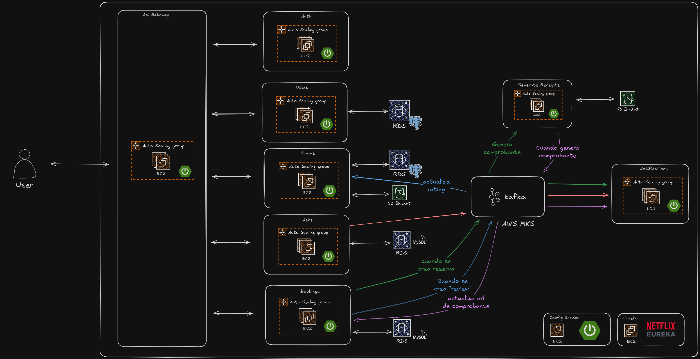

# Proyecto final de Spring + microservicios



## Descripción

Este proyecto es una aplicación que permite gestionar usuarios, reservas, facturas y reservas de habitaciones. Fue desarrollado como proyecto final de estudios sobre Java, Spring y AWS.

## Tecnologías

<ul style="display: grid; grid-template-columns: 1fr 1fr 1fr; grid-gap: 10px;">
  <li>Java</li>
  <li>Spring Boot</li>
  <li>Spring Cloud</li>
  <li>Spring Cloud Gateway</li>
  <li>Microservicios</li>
  <li>Kafka</li>
  <li>Terraform</li>
  <li>Eureka</li>
  <li>Actuator</li>
  <li>Circuit Breaker</li>
  <li>Resilience4j</li>
  <li>JPA</li>
  <li>Hibernate</li>
  <li>Flyway</li>
  <li>OpenAPI</li>
  <li>Swagger</li>
  <li>Jasper Reports</li>
  <li>Envío de emails</li>
  <li>Carga de imagenes</li>
  <li>AWS S3 (Almacenamiento de imagenes)</li>
  <li>AWS MKS (Kafka)</li>
  <li>AWS RDS (Bases de datos)</li>
  <li>AWS EC2 (Servidores)</li>
  <li>AWS ALB</li>
  <li>AWS X-Ray (Monitorización)</li>
  <li>AWS Lambda</li>
  <li>Testing (JUnit, Mockito)</li>
  <li>Coverage (Jacoco)</li>
</ul>

## Configuiración del proyecto

Requisitos:

- Git
- Docker
- Credenciales de AWS
- *Recomendado por lo menos 16gb de ram*

#### 1. Clonar proyecto

```bash
git clone https://github.com/spring-final-project/launcher.git
cd launcher
```

#### 2. Clonar los microservicios

```bash
git submodule update --init --recursive --remote
```

## Levantar en local con Docker

#### 1. Configurar variables de entorno de desarrollo

Crear el archivo `.env` basado en `.env.template` en la raíz del proyecto y completar las variables de entorno necesarias.

#### 2. Levantar con docker compose

```bash
docker compose up --build
```

---

#### Eliminar contenedores
```bash
docker compose down
```


## Desplegar en AWS

Requisitos:

- Terraform (https://www.terraform.io/)

#### 1. Configurar variables de entorno de producción

Crear el archivo `terraform.tfvars` basado en `template.tfvars` en la raíz del proyecto y completar las variables de entorno necesarias.

#### 2. Ejecutar terraform

```bash
terraform apply
```

> ![WARNING]
> Tener en cuenta que el despliegue en AWS puede llegar a demorar cerca de 30 minutos la primera vez, lo que más demora es la creación del cluster de MSK.

---

### Eliminar infraestructura desplegada en AWS

```bash
terraform destroy
```

> ![NOTE]
> Lo único que no logra destruirse correctamente es el "log group" de CloudWatch de la lambda de emails. Para eliminarla deberá hacerse manualmente desde la consola de AWS o el CLI.

## Documentación

Se puede acceder a la documentación de cada microservicio mediante swagger:

- users-ms: http://localhost:8080/api/users/swagger-ui/index.html
- auth-ms: http://localhost:8080/api/auth/swagger-ui/index.html
- rooms-ms: http://localhost:8080/api/rooms/swagger-ui/index.html
- asks-ms: http://localhost:8080/api/asks/swagger-ui/index.html
- bookings-ms: http://localhost:8080/api/bookings/swagger-ui/index.html

## Discovery (Eureka)

Para poder ver los servicios e intancias levantadas.

http://localhost:8761

## Monitorización

Para poder hacer la monitorización y seguir visualmente y con detalle la traza de las requests se está usando el servicio "X-Ray" de AWS, tanto en local como en producción.

Al levantar el proyecto completo de manera local con [docker compose](#2-levantar-con-docker-compose) el daemon de X-Ray se instala en el contenedor de cada microservicio y logra comunicarse con AWS gracias a las credenciales del archivo `.env`.

En caso de no querer utilizar este servicio cuando se levanta en local, pueden dejarse vacias las propiedades `AWS_ACCESS_KEY_ID` y `AWS_SECRET_ACCESS_KEY` (deben estar declaradas en el archivo `.env` pero puede no especificarse ningún valor para estas). Se verán warnings en consola pero esto no afectará el funcionamiento de la aplicación.

## Guardado de imágenes

En producción se está utilizando AWS S3, pero al levantar la aplicación en local las imágenes se guardan en el filesystem del contenedor, y se podrá acceder a ellas a traves del gateway.

