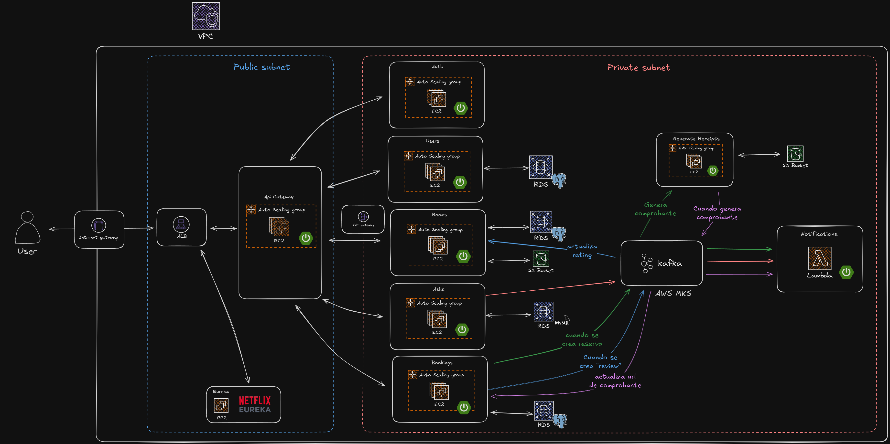

# Proyecto final de Spring + microservicios



## Descripción

Este proyecto es una aplicación que permite gestionar los usuarios, reservas, facturas y reservas de servicios. Fue desarrollado como proyecto final de estudios sobre Java y Spring.

## Tecnologías

<ul style="display: grid; grid-template-columns: 1fr 1fr 1fr; grid-gap: 10px;">
  <li>Java</li>
  <li>Spring Boot</li>
  <li>Spring Cloud</li>
  <li>Spring Cloud Gateway</li>
  <li>Microservicios</li>
  <li>Eureka</li>
  <li>Actuator</li>
  <li>Resilience4j</li>
  <li>Circuit Breaker</li>
  <li>JPA</li>
  <li>Hibernate</li>
  <li>Flyway</li>
  <li>OpenAPI</li>
  <li>Swagger</li>
  <li>Jasper Reports</li>
  <li>Envío de emails</li>
  <li>Kafka</li>
  <li>Carga de imagenes</li>
  <li>AWS S3 (Almacenamiento de imagenes)</li>
  <li>AWS MKS (Kafka)</li>
  <li>AWS RDS (Bases de datos)</li>
  <li>AWS EC2 (Servidores)</li>
  <li>AWS ASC</li>
  <li>AWS X-Ray (Monitorización)</li>
  <li>AWS Lambda</li>
  <li>Terraform</li>
  <li>Testing (JUnit, Mockito)</li>
  <li>Coverage (Jacoco)</li>
</ul>

## Levantar en local con Docker

Requisitos:

- Git
- Docker
- Credenciales de AWS
- *Recomendado por lo menos 16gb de ram*

#### 1. Clonar proyecto

```bash
git clone https://github.com/spring-final-project/launcher.git
cd launcher
```

#### 2. Asignar variables de entorno

Renombrar el archivo `.env.template` a `.env` y completar las variables de entorno.

#### 3. Clonar los microservicios

```bash
git submodule update --init --recursive --remote
```

#### 4. Levantar sistema completo

```bash
docker-compose up --build
```
